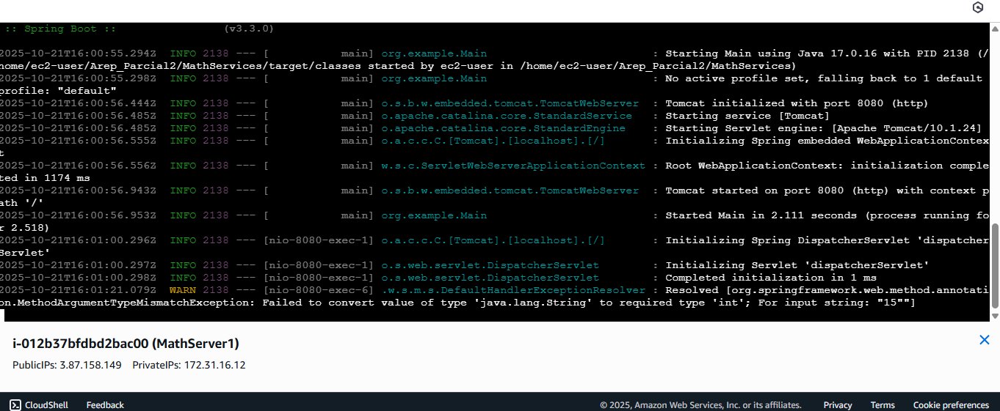

# Arep_Parcial2

Autor: David Espinosa
---
Este proyecto consiste en la construccion de un servidor proxy el cual se conecte a dos instancias de un servicio matematico desplegadas en Ec2 de aws

# Servicio Matematico
## prueba del funcionamiento del servicio
### prueba de factorial

### prueba de numeros primos

---
## Despliegue primer servicio

---
## Despliegue segundo servicio

---
## Servicio Proxy (local)

## Servidor web (Frontend)

